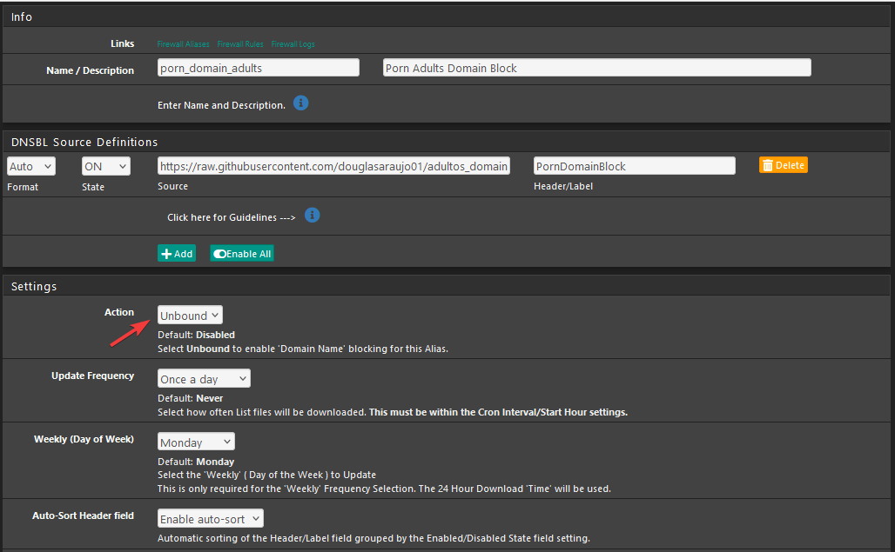

# adultos_domain
Lista de sites adultos

---
# Domínios Pornográficos

Esta lista é uma coleção de vários domínios relacionados a conteúdo adulto, principalmente sites pornográficos.

##  OBSERVE:
Muito esforço foi feito neste repositório para garantir que todos os domínios sejam válidos. Além disso, as verificações de DNS são executadas com cuidado para evitar resultados falsos o máximo possível. Mas tenha em mente que as coisas mudam muito rapidamente. **NÃO HÁ GARANTIA DE QUE ESTAS LISTAS SÃO 100% PRECISAS. USE-OS POR SUA CONTA E RISCO, ESPECIALMENTE NA PRODUÇÃO.**

### [block.txt](https://raw.githubusercontent.com/douglasaraujo01/adultos_domain/main/block.txt)
Contém todos os domínios usados ​​para sites pornográficos linha por linha. Os domínios de ignore.txt e white.txt são removidos daqui.

### [ignore.txt](https://github.com/douglasaraujo01/adultos_domain/blob/main/ignore.txt)
Uma lista de domínios cuja disponibilidade foi testada. Esses domínios não estão mais registrados ou não possuem nenhum registro DNS válido, o que também os torna incapazes de acessar.

### [white.txt](https://raw.githubusercontent.com/douglasaraujo01/adultos_domain/main/white.txt)
Aqui você pode encontrar domínios que estão listados como falsos ou cujo conteúdo foi alterado.

#### Algo está faltando?
A adição de domínios individuais não é mais suportada. Em vez disso, envie um GitHub-Repository apontando para uma lista de domínios.

Digamos que você queira adicionar a seguinte fonte:
https://github.com/user/repository/blob/branch/file.txt

Você deve fornecer o link direto para o conteúdo bruto da nova fonte, por exemplo:

```
https://raw.githubusercontent.com/user/repository/branch/file.txt
```

Arquive um ticket de emissão com o link para a nova fonte ou adicione-o ao ([sources.json](https://github.com/Bon-Appetit/porn-domains/blob/master/sources.json)) e envie uma solicitação de pull.


Sinta-se à vontade para também denunciar domínios que não são mais usados ​​para tal conteúdo explícito. Você pode registrar um ticket de emissão ou enviar uma solicitação pull com sua lista de permissões atualizada ([white.txt](https://github.com/Bon-Appetit/porn-domains/blob/master/white.txt)).

#### Criado por: https://github.com/Bon-Appetit


<>


# Implementar lista Personalizada Pfblocker
Porem utilizo utilizo para o **PFblocker**
irei agora deixar o meu tutorial de como aproveitar a lista:

## PFblocker 




```
DNSBL Source Definitions
source:	https://raw.githubusercontent.com/douglasaraujo01/adultos_domain/main/block.txt
```
## Save DNSBL Settings

Após isso vai em **Update**

```
Select 'Force' option: Reload
Select 'Reload' option: DNSBL
```